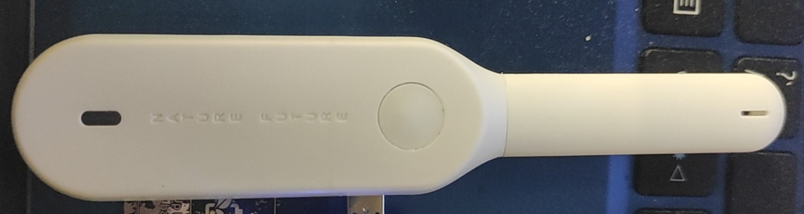
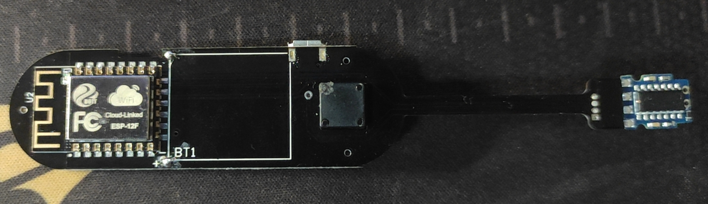
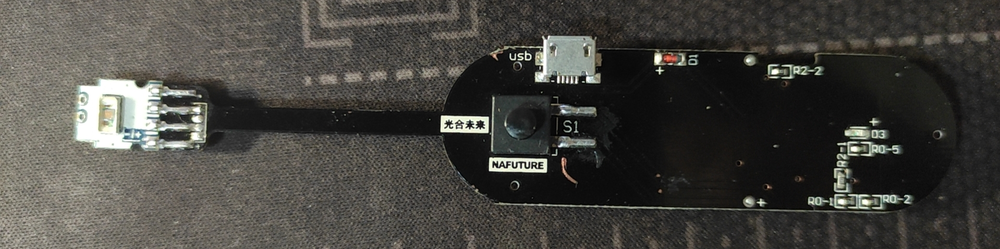
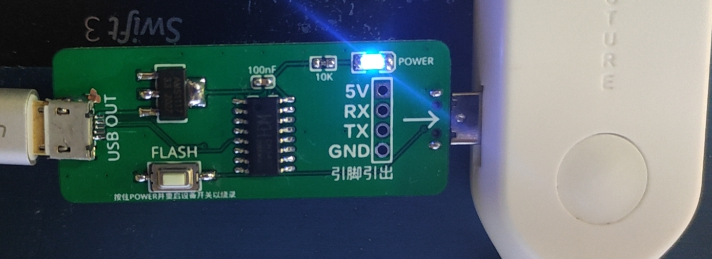
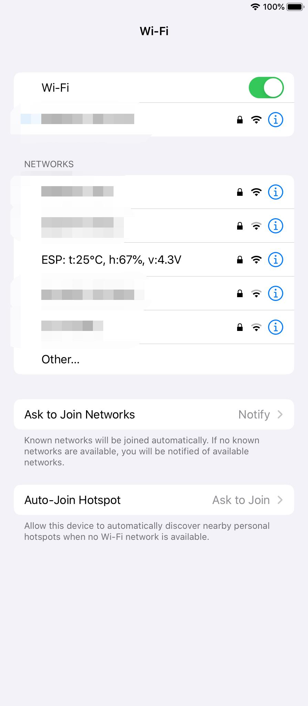

# nafuture-zxn1-resources

光合未来-知悉N1的资料

[English](./README.md) | 简体中文

## 简介

光合未来-知悉N1是[光合未来](http://www.nafuture.cn/)推出的一款温湿度传感器（已停产）。这个传感器的核心是一个ESP-12F模块（ESP8266），温湿度检测由DHT11完成，由两块200mAh的锂电池供电，micro-USB口可用来充电/烧录程序。

现在这个模块在淘宝上4.9元就可以买到（淘宝链接在底部）。









## 板载硬件

- 1 X ESP-12F (with an LED)
- 1 x DHT11
- 2 x 200mAh LiPo batteries
- 1 additional LED
- 1 x push switch

## ESP-12F接口指引

|   Pin   |          Connected to          |
|:-------:|:------------------------------:|
|  GPIO12 |            Main LED            |
|  GPIO4  |              DHT11             |
|  GPIO2  |           ESP-12F LED          |
|   ADC   |  VCC through a voltage divider |
|   TXD0  |          Micro-USB D+          |
|   RXD0  |          Micro-USB D-          |
|  GPIO0  |          Micro-USB ID          |

## 测量VCC（电池）电压

电路图:

```
            ___ VCC
             |
+-----+    <4.7K>
| ... |      |
| ADC |------+
| ... |      |
+-----+    <1K>
            _|_ 
               GND

```

ESP8266的ADC返回值在0（0V）和1024（1V）之间。由ADC返回值可以按如下公式计算出VCC电压：

```
VCC电压 = ADC返回值 / 1024 / 10 * 57
```

## 使用[下载器](https://market.m.taobao.com/app/idleFish-F2e/widle-taobao-rax/page-detail?wh_weex=true&wx_navbar_transparent=true&id=626032002165&ut_sk=1.X23p8dbHZsEDAI2wCPftXkIY_21407387_1601553035380.Copy.detail.626032002165.3586168982&forceFlush=1)更新ZXN1的固件（也可自己用micro-USB转接板和一般的USB-UART下载器做一个）

- 把下载器连接上电脑和ZXN1
- 运行烧录程序（esptool）
- 按住下载器上的`flash`按键，同时打开（或重启）ZXN1
- 耐心等待烧录结束

## MicroPython测试程序

本仓库中的MicroPython程序在ZXN1开机时测量温度、湿度及电池电压，并把测量结果设置成ESP8266上AP模式的SSID。手机WiFi设置页就可以看到测量结果：（连接这个AP没有任何效果）



详见 [./upython](./upython)

### How to Use

- Install [Thonny IDE](https://thonny.org/) (recommended)
- Download the latest micropython firmware (currently V1.13) for ESP8266 from <https://micropython.org/download/>
- Upload the firmware to your ZXN1 through Thonny (or esptool if you know how to use it)
- Upload `battery.py`, `sensor.py`, `main.py` to your ZXN1 using Thonny
- Restart your ZXN1 to run the code

## 购买链接

- [知悉N1淘宝链接](https://m.tb.cn/h.Vzupfv7?sm=34d8ae)
- [烧录器闲鱼链接](https://market.m.taobao.com/app/idleFish-F2e/widle-taobao-rax/page-detail?wh_weex=true&wx_navbar_transparent=true&id=626032002165&ut_sk=1.X23p8dbHZsEDAI2wCPftXkIY_21407387_1601553035380.Copy.detail.626032002165.3586168982&forceFlush=1)
